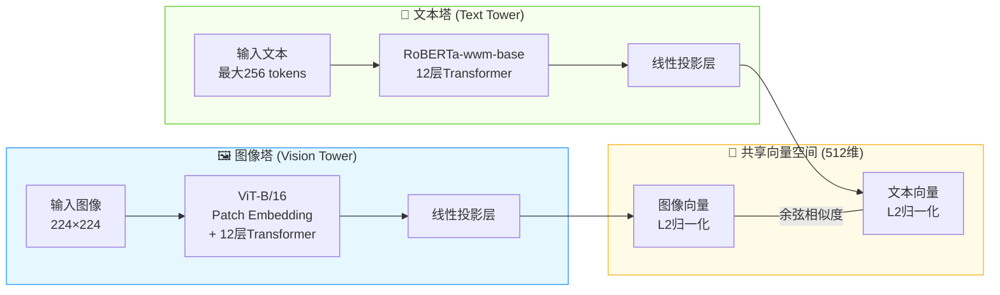

# 商品图像检索系统项目文档

## 1. 项目架构与开发流程

### 1.1 整体架构

本项目构建了一套中文商品图像检索系统，采用“本地CLIP模型嵌入 + 云端向量库检索 + Gradio前端交互”的分层架构。系统由5个核心组件组成，各组件功能说明如下：

| 层级         | 组件               | 功能                                                         | 部署方式 |
| ------------ | ------------------ | ------------------------------------------------------------ | -------- |
| **交互层**   | `ui.py`（Gradio）  | 基于 Gradio 构建的可视化前端界面。提供双模态搜索（文本/图像）输入与预览，集成搜索触发按钮及参数调节滑块（Top-K、相似度阈值），并利用画廊组件支持结果的直观展示、下载与一键收藏功能。  | 本地     |
| **业务层**   | `search_engine.py` | 封装`ProductSearchEngine`类，初始化时加载CLIP模型，提供`encode_text()`、`encode_image()`方法生成向量，`search_by_text()`、`search_by_image()`方法调用Upstash检索并返回结果列表`[{url, score}]`。 | 本地     |
| **嵌入层**   | Chinese-CLIP模型   | ViT-B/16图像编码器 + RoBERTa-wwm-base文本编码器，将图像和文本分别映射为512维归一化向量，统一到同一语义空间。 | 本地GPU  |
| **向量库**   | Upstash Vector     | 无服务器向量数据库，存储预先计算的商品图像嵌入向量，索引类型为DENSE，相似度函数为COSINE，维度为512。 | 云端     |
| **图片存储** | Cloudflare R2      | 存储原始商品图片，提供公开URL。使用`upload_to_r2_parallel.py`脚本通过boto3多线程上传图片，并在元数据中记录`https://<bucket>.<account>.r2.dev/<filename>`形式的公开链接。 | 云端     |

### 1.2 开发流程

本项目的开发遵循“数据准备 → 模型离线下载 → 图片上云 → 向量入库 → 搜索服务部署”的流程：

1. **环境准备**：使用Python 3.13，安装PyTorch、Transformers、Gradio、Upstash Vector、boto3等依赖。配置`.env`环境变量（Upstash Vector凭证、R2端点/密钥/桶名/公开域名）。

2. **CLIP模型离线下载**：运行`download_model.py`，通过`huggingface_hub.snapshot_download()`将`OFA-Sys/chinese-clip-vit-base-patch16`模型下载到本地`./models/chinese-clip/`目录。

3. **图片上传至Cloudflare R2**：运行`upload_to_r2_parallel.py`，利用boto3客户端多线程（默认20线程）将`./images/`文件夹中的图片上传至预先创建的R2存储桶。完成后图片可通过`R2_PUBLIC_URL/<filename>`公开访问，为后续向量入库提供URL元数据。

4. **创建Upstash Vector索引**：在Upstash Console创建索引，配置维度=512、相似度函数=COSINE、索引类型=DENSE、嵌入模型选择“自备模型（CUSTOM）”。

5. **图像嵌入入库（数据管线）**：运行`image_embed_to_upstash_vector.py`，遍历`./images/`文件夹中的图片，使用Chinese-CLIP批量提取512维特征向量，对向量做L2归一化后，连同R2公开URL元数据分批upsert到Upstash Vector。

6. **启动搜索服务**：运行`python ui.py` 启动基于 Gradio 构建的本地 Web 前端界面。服务成功启动后，会在终端输出本地访问链接（通常为 `http://127.0.0.1:7860`）。用户通过浏览器访问该地址，即可使用双模态（文本/图片）搜索界面。系统在接收到用户输入后，会实时调用本地 CLIP 模型生成查询向量，向云端 Upstash Vector 发起检索，并在前端画廊中渲染返回的商品图片与相似度信息。

### 1.3 文件清单

| 文件                               | 用途                                                         |
| ---------------------------------- | ------------------------------------------------------------ |
| `download_model.py`                | 预先下载CLIP模型到本地                                       |
| `upload_to_r2_parallel.py`         | 多线程上传图片至Cloudflare R2存储桶                          |
| `image_embed_to_upstash_vector.py` | 离线数据管线：图像→嵌入向量→Upstash入库                      |
| `search_engine.py`                 | 搜索引擎类（ProductSearchEngine），封装模型加载、向量编码、检索接口 |
| `ui.py`                            | 基于 Gradio 构建的前端交互界面脚本，负责接收用户输入、调用搜索引擎并渲染满足五阶段搜索框架的可视化结果 |
| `.env`                             | 环境变量（Upstash URL/Token、R2端点/密钥/桶名/公开域名）     |
| `models/chinese-clip/`             | 本地离线模型文件（首次由download_model.py下载）              |

## 2. 数据集

### 2.1 来源

本系统使用**Products-10K**数据集，由京东AI研究院（JDAI）构建，作为ICPR 2020大规模商品图像识别挑战赛的官方数据集发布。数据集的所有图片均采集自京东商城的真实在线商品，涵盖商家商品展示图以及用户下单实拍图。数据集论文题为《Products-10K: A Large-scale Product Recognition Dataset》（arXiv:2008.10545），项目主页为[products-10k.github.io](https://products-10k.github.io/)。

该数据集填补了商品识别领域的重要缺口：在Products-10K之前，已有的商品基准数据集要么规模太小（商品数量有限），要么标注存在噪声（缺乏人工标注），难以支撑高精度的SKU级别商品识别研究。

### 2.2 规模与内容

Products-10K数据集的核心统计指标如下：

- **SKU数量**：约10,000个精细粒度的SKU（库存单位），均为京东商城消费者经常购买的商品。
- **图像总量**：约150,000张（其中测试集约10,000张，训练集约140,000张），由于真实应用场景的差异，各类别的图像数量分布不均衡。
- **总数据量**：约20 GB。
- **类别覆盖**：涵盖时尚、3C电子、食品、保健、家居用品等10大类全品类商品。
- **标注层级**：标注文件包含`class`和`group`两个层级。`class`层级有9,000+个类别，但部分类别样本极少（仅1-2张）；`group`层级有360个类别，将视觉特征相近的class归并，更适合用于分类训练。
- **图像来源与特点**：数据来自电商商品展示图和用户实拍图，背景干扰比ImageNet少，更贴近互联网电商真实场景。

对于本项目而言，使用约55,000张训练集图片进行嵌入入库，可覆盖主要的细粒度商品类别，满足中文文本到图像的跨模态检索需求。

## 3. CLIP模型技术特点

### 3.1 模型选型与架构

本项目采用**`OFA-Sys/chinese-clip-vit-base-patch16`**模型，这是阿里达摩院发布的Chinese-CLIP系列的基础版本，专为中文场景的跨模态图文检索任务设计。该模型采用经典的**双塔结构（Dual-Encoder Architecture）**：

- **图像编码器（Vision Tower）**：基于**ViT-B/16**（Vision Transformer Base，Patch Size 16）架构。输入图像被切分为16×16的patches，经过12层Transformer编码，最终通过线性投影层映射为512维特征向量。
- **文本编码器（Text Tower）**：采用**RoBERTa-wwm-base**（基于全词掩码的中文RoBERTa），12层Transformer，支持最长256 tokens的中文输入。基于中文全词掩码的预训练方式，使其在处理中文短语和商品描述时具有更强的语义理解能力。
- **特征归一化**：两个塔的输出经过L2归一化处理，将向量投影到单位超球面，确保余弦相似度计算的数值稳定性。

### 3.2 训练机制与关键技术

1. **大规模中文预训练**：该模型在大约**2亿对中文图文数据**上进行对比学习预训练，训练数据涵盖了新闻、百科、电商等多个领域，使模型能够泛化到不同类型的中文图文匹配场景。

2. **对比学习（Contrastive Learning）**：模型使用InfoNCE损失函数，在共享的512维语义空间中拉近匹配的图文对，推远非匹配的图文对。训练后的模型能将图像和文本映射到同一语义空间，使得语义相似的图像和文本在该空间中具有较小的余弦距离，从而实现跨模态检索。

3. **两阶段预训练策略**：Chinese-CLIP提出了独特的两阶段训练方法：第一阶段冻结图像编码器参数，仅训练文本编码器，让文本特征逐步对齐图像特征空间；第二阶段解冻所有参数进行联合微调，进一步增强模型的跨模态对齐能力。

### 3.3 在本项目中的应用

| 搜索模式     | 工作流程                                                     |
| ------------ | ------------------------------------------------------------ |
| **文本搜图** | 用户输入中文商品描述 → CLIP文本编码器 → 512维查询向量 → L2归一化 → Upstash Vector余弦相似度检索 → 按相似度降序返回Top-K商品图片URL及相似度分数。 |
| **以图搜图** | 用户上传商品图片 → CLIP图像编码器 → 512维查询向量 → L2归一化 → Upstash Vector余弦相似度检索 → 返回视觉相似商品的图片URL及相似度分数。 |

## 4. 五阶段搜索框架（Five‑Stage Search Framework）的界面映射

本系统的 UI 设计严格遵循了交互设计中的 Five-Stage Search Framework，旨在为所有用户提供流畅、直观且可控的图像检索体验。

### 4.1 框架阶段与对应 UI 设计

1. **查询表达（Query Formulation）**
   - **对应 Five-Stage 中的 Formulation 阶段：** 界面左侧通过 `gr.Tabs` 选项卡，分别提供了文本输入框（用于文字搜图）和图片上传组件（用于以图搜图）。
   - **查询预览：** 无论是键入的文字还是拖拽上传的图片，用户都能在搜索窗口中进行实时预览，确保查询意图被准确表达。

2. **查询理解（Query Understanding）**
   - 虽然主要依赖于后端的 CLIP 模型，但前端 UI 通过清晰的输入提示（如 Placeholder：“例如：一瓶红色的饮料...”）和组件标签，引导用户输入更易于系统理解的查询条件。系统会自动根据用户所在的选项卡模态，准备相应的处理逻辑，降低用户的认知负担。

3. **搜索执行（Search Execution）**
   - **对应 Five-Stage 中的 Initiation of action 阶段：** 在文本和图像输入区的下方，系统分别设置了明确且醒目的主操作按钮（“搜索 (文字)”与“搜索 (图片)”）。这为用户提供了明确的动作触发点，点击即可立即向向量数据库发起检索请求。

4. **结果呈现（Result Presentation）**
   - **对应 Five-Stage 中的 Review of results 阶段：** 搜索完成后，界面右侧的输出区不仅会通过 `gr.Gallery` 画廊组件按余弦相似度降序展示图片，还会在画廊上方提供明确的**结果总览**信息（例如显示“共检索到 12 条相关的结果”）。这帮助用户快速评估检索规模与质量。

5. **交互与优化（Interaction & Refinement）**
   - **改进查询（对应 Refinement 阶段）：** 在界面左侧的参数设置区，系统提供了“Top-K 返回数量”和“相似度阈值”的交互式滑动条。用户在审视初步结果后，随时可以调整滑块来过滤出更精确的图片，实现渐进式的查询优化。
   - **使用结果（对应 Use 阶段）：** 赋予用户对检索结果的实际支配权。用户不仅可以通过画廊右上角的图标直接**下载**满意的图片，还可以通过点击图片，将其一键添加至底部的“**我的收藏夹**”画廊中，完美实现了结果的应用与留存。

### 4.2 用户如何感知五阶段

为了让用户在实际操作中清晰、自然地感知到“五阶段搜索框架”，本系统的交互界面将这五个抽象的理论阶段转化为了符合人类直觉的**视觉隐喻**与**即时反馈环（Feedback Loops）**：

1. **通过空间布局感知“查询准备”：**
   用户进入页面时，界面左侧直观的输入组件（文本框/上传区）与下方的参数滑块共同构成了用户的“准备区”。通过这种合理的空间划分，用户首先在视觉上感知到 **Formulation（制定查询）** 阶段。输入内容后，组件内部的文本或图片预览提供了强烈的视觉确认，使用户在心理上明确知晓“系统已经捕获到了我的检索意图”。

2. **通过状态可见性感知“动作发起”：**
   当用户点击醒目的蓝色主按钮时，触发了 **Initiation（发起操作）**。随后，右侧状态提示语由“等待搜索...”迅速转变为带有加粗数字的“共检索到 XX 条结果...”。这种“动静结合”的异步反馈，满足了人机交互中“系统状态可见性（Visibility of System Status）”的原则，让用户在认知上清晰感知到检索动作已被成功执行，并感知到了从“发送请求”到“获取结果”的过渡。

3. **通过网格画廊感知“结果评估”：**
   在 **Review（评估结果）** 阶段，高保真网格画廊组件将检索到的商品图片整齐排列。这种直观的图像呈现方式契合了人类强大的视觉模式识别能力。用户只需通过简单的上下滚动和视线扫视，即可在几秒钟内快速评估系统返回的内容是否符合预期，以及各个结果之间的相似度差异。

4. **通过动态响应感知“查询微调”：**
   当返回结果存在噪点或数量不符预期时，用户调节滑块的操作能带来即时隐式反馈。随着相似度阈值的拉高，右侧画廊的低分图片会实时过滤减少；随着 Top-K 的拖动，画面会迅速扩充或精简。这种无需刷新页面的动态变化，让用户产生了强烈的“掌控感”，清晰感知到自己正在进行 **Refinement（改进查询）**。

5. **通过持久化仓储感知“结果使用”：**
   最终，当用户将鼠标悬浮在满意的图片上点击下载，或者直接点击图片将其同步到最底部的“我的收藏夹”时，用户完成了 **Use（使用结果）** 阶段。底部的独立画廊作为一个持久化的视觉仓储，让用户随时看到自己的劳动成果，从而获得了明确的“任务完成感（Closure）”和系统的实用价值。

## 5. 两种输入方式的用户体验设计

在跨模态搜索引擎中，“以文搜图”和“以图搜图”代表了两种截然不同的用户认知模型。

### 5.1 文字输入 vs 图片输入的操作差异

- **文字输入（文本搜图）：**
  - **认知负荷：** 用户需要将脑海中的视觉形象转化为精准的语义词汇。适合目标明确（如“红色的运动鞋”）或具有抽象概念特征的搜索。
  - **操作流程：** 倾向于“思考意图 → 键入文字 → 发起搜索”。对于难以用言语形容的复杂图案，文本输入的表达成本较高。
  
- **图片输入（以图搜图）：**
  - **认知负荷：** 表达成本极低，用户无需构思语言，直接利用现有的视觉素材。极其适合“找同款”或“难以描述的复杂花纹/款式”场景。
  - **操作流程：** 倾向于“浏览获取截图 → 拖拽上传图片 → 发起搜索”。其痛点在于用户手头必须有一张现成的“种子图片”。

### 5.2 统一友好的设计策略

为了让这两种输入方式在同一个界面中对用户同样友好，本系统在 UI 布局和交互逻辑上采取了以下策略：

1. **空间隔离与视觉统一：** 使用选项卡（Tabs）将文本输入和图像上传在物理空间上隔开，避免视觉干扰和误操作；但同时保持了完全一致的“输入区 -> 触发按钮”的垂直布局逻辑。无论用户选择哪种方式，操作动线都是一致的由上至下。
2. **同构的结果反馈：** 无论前端通过哪种方式发起请求，后端的返回数据结构均被抹平统一。右侧的“搜索结果”评估区和底部的“我的收藏夹”对于双模态是共享的。这种一致的反馈机制大大降低了用户在不同模态间切换时的学习成本。
3. **参数共用的无缝衔接：** “Top-K”与“相似度阈值”等改进查询（Refinement）工具被设计在选项卡外部的全局区域。这意味着高级过滤体验在两种输入方式下保持绝对一致，保证了系统级操作逻辑的连贯性。

### 5.3 未来优化方向

基于当前系统的交互体验与五阶段搜索框架（Five-Stage Search Framework）的指导，未来可从以下几个维度对系统进行深度优化：

1. **引入多模态联合检索（Joint Multi-modal Search）：**
   当前的 Formulation（制定查询）阶段要求用户在“文字”和“图片”中二选一。未来的优化方向是允许用户同时输入图文进行联合搜索（例如：上传一张椅子的图片，并附加文本描述“换成皮质材料”），从而极大地降低用户表达复杂意图的门槛，提供更细粒度的检索控制。

2. **基于元数据的多维度过滤（Metadata Filtering）：**
   目前的 Refinement（改进查询）阶段仅依赖于 Top-K 数量和全局相似度阈值滑块。根据 PPT 中关于 Review 与 Refinement 阶段的建议，未来可深度挖掘 Products-10K 数据集自带的分类信息，在前端增加结构化字段（如商品类别、品牌、颜色等）的下拉筛选框，允许用户在视觉相似度的基础上进行硬性条件约束。

3. **增加显式用户反馈机制（Explicit User Feedback）：**
   在 Use（使用结果）阶段，当前系统已实现下载与收藏功能。进一步的优化是探索收集显式的用户反馈，例如为每张检索结果添加“点赞 / 踩（Thumbs up/down）”机制。这不仅能增强用户参与感，其收集到的点击流日志（Click-through logs）还可用于后续通过强化学习（RLHF）进一步微调 Chinese-CLIP 模型的对齐能力。

4. **突破原型框架的交互局限（Custom Frontend Migration）：**
   当前界面基于 Gradio 框架构建，虽能快速验证概念，但其高度封装的组件（如 `gr.Gallery`）在定制化微观交互上存在局限。例如，无法在结果画廊的同一张图片悬浮栏上同时并列呈现“下载”与“心形收藏”按钮。未来考虑向 React 或 Vue 等现代化前端框架迁移，实现更加细腻、符合用户直觉的沉浸式交互面板。
