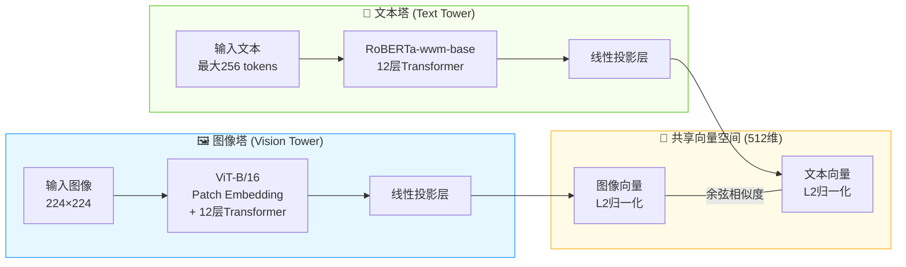

# 商品图像检索系统项目文档

## 1. 项目架构与开发流程

### 1.1 整体架构

本项目构建了一套中文商品图像检索系统，采用“本地CLIP模型嵌入 + 云端向量库检索 + Gradio前端交互”的分层架构。系统由5个核心组件组成，各组件功能说明如下：

| 层级         | 组件               | 功能                                                         | 部署方式 |
| ------------ | ------------------ | ------------------------------------------------------------ | -------- |
| **交互层**   | `ui.py`（Gradio）  | **TODO**                                                     | 本地     |
| **业务层**   | `search_engine.py` | 封装`ProductSearchEngine`类，初始化时加载CLIP模型，提供`encode_text()`、`encode_image()`方法生成向量，`search_by_text()`、`search_by_image()`方法调用Upstash检索并返回结果列表`[{url, score}]`。 | 本地     |
| **嵌入层**   | Chinese-CLIP模型   | ViT-B/16图像编码器 + RoBERTa-wwm-base文本编码器，将图像和文本分别映射为512维归一化向量，统一到同一语义空间。 | 本地GPU  |
| **向量库**   | Upstash Vector     | 无服务器向量数据库，存储预先计算的商品图像嵌入向量，索引类型为DENSE，相似度函数为COSINE，维度为512。 | 云端     |
| **图片存储** | Cloudflare R2      | 存储原始商品图片，提供公开URL。使用`upload_to_r2_parallel.py`脚本通过boto3多线程上传图片，并在元数据中记录`https://<bucket>.<account>.r2.dev/<filename>`形式的公开链接。 | 云端     |

### 1.2 开发流程

本项目的开发遵循“数据准备 → 模型离线下载 → 图片上云 → 向量入库 → 搜索服务部署”的流程：

1. **环境准备**：使用Python 3.13，安装PyTorch、Transformers、Gradio、Upstash Vector、boto3等依赖。配置`.env`环境变量（Upstash Vector凭证、R2端点/密钥/桶名/公开域名）。

2. **CLIP模型离线下载**：运行`download_model.py`，通过`huggingface_hub.snapshot_download()`将`OFA-Sys/chinese-clip-vit-base-patch16`模型下载到本地`./models/chinese-clip/`目录。

3. **图片上传至Cloudflare R2**：运行`upload_to_r2_parallel.py`，利用boto3客户端多线程（默认20线程）将`./images/`文件夹中的图片上传至预先创建的R2存储桶。完成后图片可通过`R2_PUBLIC_URL/<filename>`公开访问，为后续向量入库提供URL元数据。

4. **创建Upstash Vector索引**：在Upstash Console创建索引，配置维度=512、相似度函数=COSINE、索引类型=DENSE、嵌入模型选择“自备模型（CUSTOM）”。

5. **图像嵌入入库（数据管线）**：运行`image_embed_to_upstash_vector.py`，遍历`./images/`文件夹中的图片，使用Chinese-CLIP批量提取512维特征向量，对向量做L2归一化后，连同R2公开URL元数据分批upsert到Upstash Vector。

6. **启动搜索服务**：运行`python ui.py`**TODO**

### 1.3 文件清单

| 文件                               | 用途                                                         |
| ---------------------------------- | ------------------------------------------------------------ |
| `download_model.py`                | 预先下载CLIP模型到本地                                       |
| `upload_to_r2_parallel.py`         | 多线程上传图片至Cloudflare R2存储桶                          |
| `image_embed_to_upstash_vector.py` | 离线数据管线：图像→嵌入向量→Upstash入库                      |
| `search_engine.py`                 | 搜索引擎类（ProductSearchEngine），封装模型加载、向量编码、检索接口 |
| `ui.py`                            | **TODO**                                                     |
| `.env`                             | 环境变量（Upstash URL/Token、R2端点/密钥/桶名/公开域名）     |
| `models/chinese-clip/`             | 本地离线模型文件（首次由download_model.py下载）              |

## 2. 数据集

### 2.1 来源

本系统使用**Products-10K**数据集，由京东AI研究院（JDAI）构建，作为ICPR 2020大规模商品图像识别挑战赛的官方数据集发布。数据集的所有图片均采集自京东商城的真实在线商品，涵盖商家商品展示图以及用户下单实拍图。数据集论文题为《Products-10K: A Large-scale Product Recognition Dataset》（arXiv:2008.10545），项目主页为[products-10k.github.io](https://products-10k.github.io/)。

该数据集填补了商品识别领域的重要缺口：在Products-10K之前，已有的商品基准数据集要么规模太小（商品数量有限），要么标注存在噪声（缺乏人工标注），难以支撑高精度的SKU级别商品识别研究。

### 2.2 规模与内容

Products-10K数据集的核心统计指标如下：

- **SKU数量**：约10,000个精细粒度的SKU（库存单位），均为京东商城消费者经常购买的商品。
- **图像总量**：约150,000张（其中测试集约10,000张，训练集约140,000张），由于真实应用场景的差异，各类别的图像数量分布不均衡。
- **总数据量**：约20 GB。
- **类别覆盖**：涵盖时尚、3C电子、食品、保健、家居用品等10大类全品类商品。
- **标注层级**：标注文件包含`class`和`group`两个层级。`class`层级有9,000+个类别，但部分类别样本极少（仅1-2张）；`group`层级有360个类别，将视觉特征相近的class归并，更适合用于分类训练。
- **图像来源与特点**：数据来自电商商品展示图和用户实拍图，背景干扰比ImageNet少，更贴近互联网电商真实场景。

对于本项目而言，使用约55,000张训练集图片进行嵌入入库，可覆盖主要的细粒度商品类别，满足中文文本到图像的跨模态检索需求。

## 3. CLIP模型技术特点

### 3.1 模型选型与架构

本项目采用**`OFA-Sys/chinese-clip-vit-base-patch16`**模型，这是阿里达摩院发布的Chinese-CLIP系列的基础版本，专为中文场景的跨模态图文检索任务设计。该模型采用经典的**双塔结构（Dual-Encoder Architecture）**：

- **图像编码器（Vision Tower）**：基于**ViT-B/16**（Vision Transformer Base，Patch Size 16）架构。输入图像被切分为16×16的patches，经过12层Transformer编码，最终通过线性投影层映射为512维特征向量。
- **文本编码器（Text Tower）**：采用**RoBERTa-wwm-base**（基于全词掩码的中文RoBERTa），12层Transformer，支持最长256 tokens的中文输入。基于中文全词掩码的预训练方式，使其在处理中文短语和商品描述时具有更强的语义理解能力。
- **特征归一化**：两个塔的输出经过L2归一化处理，将向量投影到单位超球面，确保余弦相似度计算的数值稳定性。

### 3.2 训练机制与关键技术

1. **大规模中文预训练**：该模型在大约**2亿对中文图文数据**上进行对比学习预训练，训练数据涵盖了新闻、百科、电商等多个领域，使模型能够泛化到不同类型的中文图文匹配场景。

2. **对比学习（Contrastive Learning）**：模型使用InfoNCE损失函数，在共享的512维语义空间中拉近匹配的图文对，推远非匹配的图文对。训练后的模型能将图像和文本映射到同一语义空间，使得语义相似的图像和文本在该空间中具有较小的余弦距离，从而实现跨模态检索。

3. **两阶段预训练策略**：Chinese-CLIP提出了独特的两阶段训练方法：第一阶段冻结图像编码器参数，仅训练文本编码器，让文本特征逐步对齐图像特征空间；第二阶段解冻所有参数进行联合微调，进一步增强模型的跨模态对齐能力。

### 3.3 在本项目中的应用

| 搜索模式     | 工作流程                                                     |
| ------------ | ------------------------------------------------------------ |
| **文本搜图** | 用户输入中文商品描述 → CLIP文本编码器 → 512维查询向量 → L2归一化 → Upstash Vector余弦相似度检索 → 按相似度降序返回Top-K商品图片URL及相似度分数。 |
| **以图搜图** | 用户上传商品图片 → CLIP图像编码器 → 512维查询向量 → L2归一化 → Upstash Vector余弦相似度检索 → 返回视觉相似商品的图片URL及相似度分数。 |

## 4. 五阶段搜索框架（Five‑Stage Search Framework）的界面映射

### 4.1 框架阶段与对应 UI 设计
1. **查询表达（Query Formulation）**

2. **查询理解（Query Understanding）**

3. **搜索执行（Search Execution）**

4. **结果呈现（Result Presentation）**

5. **交互与优化（Interaction & Refinement）**

### 4.2 用户如何感知五阶段

## 5. 两种输入方式的用户体验设计

### 5.1 文字输入 vs 图片输入的操作差异
- **文字输入（文本搜图）**

- **图片输入（以图搜图）**

### 5.2 统一友好的设计策略

### 5.3 未来优化方向
