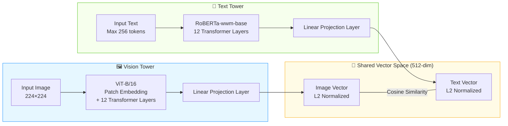

# Product Image Retrieval System Project Documentation

## 1. Project Architecture and Development Process

### 1.1 Overall Architecture

This project builds a Chinese product image retrieval system, adopting a layered architecture of "local CLIP model embedding + cloud vector database retrieval + Gradio frontend interaction". The system consists of 5 core components. The functions of each component are described below:

| Layer               | Component          | Function                                                     | Deployment |
| ------------------- | ------------------ | ------------------------------------------------------------ | ---------- |
| **Presentation**    | `ui.py` (Gradio)   | A visual front-end interface built based on Gradio. It provides dual-modal search (text/image) input and preview, integrates search trigger buttons and parameter adjustment sliders (Top-K, similarity threshold), and uses the gallery component to support intuitive display, download and one-click collection of results. | Local      |
| **Business**        | `search_engine.py` | Encapsulates the `ProductSearchEngine` class, loads the CLIP model during initialization, provides `encode_text()` and `encode_image()` methods to generate vectors, and `search_by_text()` and `search_by_image()` methods to call Upstash retrieval and return result lists `[{url, score}]`. | Local      |
| **Embedding**       | Chinese-CLIP model | ViT-B/16 image encoder + RoBERTa-wwm-base text encoder, maps images and text respectively to 512-dimensional normalized vectors, unified into the same semantic space. | Local GPU  |
| **Vector Database** | Upstash Vector     | Serverless vector database, stores precomputed product image embedding vectors, index type is DENSE, similarity function is COSINE, dimension is 512. | Cloud      |
| **Image Storage**   | Cloudflare R2      | Stores original product images, provides public URLs. Uses the `upload_to_r2_parallel.py` script to upload images via boto3 multithreading, and records public links in the form of `https://<bucket>.<account>.r2.dev/<filename>` in metadata. | Cloud      |

### 1.2 Development Process

The development of this project follows the process of "data preparation → offline model download → image upload to cloud → vector ingestion → search service deployment":

1. **Environment Preparation**: Use Python 3.13, install PyTorch, Transformers, Gradio, Upstash Vector, boto3, and other dependencies. Configure the `.env` environment variables (Upstash Vector credentials, R2 endpoint/key/bucket name/public domain).

2. **Offline CLIP Model Download**: Run `download_model.py` to download the `OFA-Sys/chinese-clip-vit-base-patch16` model to the local `./models/chinese-clip/` directory via `huggingface_hub.snapshot_download()`.

3. **Image Upload to Cloudflare R2**: Run `upload_to_r2_parallel.py`, using the boto3 client with multithreading (default 20 threads) to upload images from the `./images/` folder to a pre-created R2 bucket. Once completed, images can be publicly accessed via `R2_PUBLIC_URL/<filename>`, providing URL metadata for subsequent vector ingestion.

4. **Create Upstash Vector Index**: Create an index in the Upstash Console with the configuration: dimension=512, similarity function=COSINE, index type=DENSE, and embedding model set to "Bring Your Own Model (CUSTOM)".

5. **Image Embedding Ingestion (Data Pipeline)**: Run `image_embed_to_upstash_vector.py`, iterate over images in the `./images/` folder, use Chinese-CLIP to batch extract 512-dimensional feature vectors, perform L2 normalization on the vectors, and then upsert them in batches into Upstash Vector together with the R2 public URL metadata.

6. **Launch Search Service**: Run `python ui.py` , launch the local web frontend interface built with Gradio. Once the service starts successfully, a local access link (typically `http://127.0.0.1:7860`) will be displayed in the terminal. Users can access this address via a browser to use the dual-modal (text/image) search interface. Upon receiving user input, the system will invoke the local CLIP model in real time to generate query vectors, perform retrieval against the cloud-based Upstash Vector database, and render the retrieved product images along with similarity scores in the frontend gallery.

### 1.3 File List

| File                               | Purpose                                                      |
| ---------------------------------- | ------------------------------------------------------------ |
| `download_model.py`                | Pre-download the CLIP model locally                          |
| `upload_to_r2_parallel.py`         | Multithreaded upload of images to Cloudflare R2 bucket       |
| `image_embed_to_upstash_vector.py` | Offline data pipeline: images → embedding vectors → Upstash ingestion |
| `search_engine.py`                 | Search engine class (ProductSearchEngine), encapsulating model loading, vector encoding, and retrieval interfaces |
| `ui.py`                            | The front-end interactive interface script built based on Gradio is responsible for receiving user input, invoking search engines, and rendering visual results that meet the five-stage search framework |
| `.env`                             | Environment variables (Upstash URL/Token, R2 endpoint/key/bucket name/public domain) |
| `models/chinese-clip/`             | Local offline model files (first downloaded by download_model.py) |

## 2. Dataset

### 2.1 Source

This system uses the **Products-10K** dataset, constructed by JD AI Research (JDAI) and released as the official dataset for the ICPR 2020 Large-Scale Product Recognition Challenge. All images in the dataset are collected from real online products on JD.com, covering both merchant product display images and user-submitted real-life photos. The dataset is described in the paper "Products-10K: A Large-scale Product Recognition Dataset" (arXiv:2008.10545), with the project homepage at [products-10k.github.io](https://products-10k.github.io/).

This dataset fills an important gap in the field of product recognition: before Products-10K, existing product benchmark datasets were either too small in scale (limited number of products) or contained noisy annotations (lacking manual annotation), making them insufficient to support high-precision SKU-level product recognition research.

### 2.2 Scale and Content

The key statistics of the Products-10K dataset are as follows:

- **Number of SKUs**: Approximately 10,000 fine-grained SKUs (stock keeping units), all of which are frequently purchased products by JD.com consumers.

- **Total Images**: About 150,000 images (with around 10,000 in the test set and 140,000 in the training set); due to differences in real application scenarios, the number of images per category is unevenly distributed.

- **Total Data Size**: Approximately 20 GB.

- **Category Coverage**: Covers 10 major categories of full-category products including fashion, 3C electronics, food, health care, and household items.

- **Annotation Hierarchy**: The annotation files contain two levels: `class` and `group`. The `class` level has over 9,000 categories, but some categories have very few samples (only 1-2 images); the `group` level has 360 categories, grouping classes with similar visual features together, making it more suitable for classification training.

- **Image Source and Characteristics**: The data comes from e-commerce product display images and user real-life photos, with less background clutter than ImageNet, and is closer to real-world internet e-commerce scenarios.

For this project, using approximately 55,000 training set images for embedding and ingestion can cover the main fine-grained product categories, meeting the cross-modal retrieval needs from Chinese text to images.

## 3. CLIP Model Technical Features

### 3.1 Model Selection and Architecture

This project adopts the **`OFA-Sys/chinese-clip-vit-base-patch16`** model, which is the base version of the Chinese-CLIP series released by Alibaba DAMO Academy, specifically designed for cross-modal image-text retrieval tasks in Chinese scenarios. The model employs the classic **dual-encoder architecture**:

- **Vision Tower**: Based on the **ViT-B/16** (Vision Transformer Base, Patch Size 16) architecture. The input image is split into 16×16 patches, encoded through 12 Transformer layers, and finally mapped to a 512-dimensional feature vector via a linear projection layer.
- **Text Tower**: Uses **RoBERTa-wwm-base** (a Chinese RoBERTa based on whole word masking), with 12 Transformer layers, supporting up to 256 tokens of Chinese input. Its pre-training approach based on Chinese whole word masking gives it stronger semantic understanding capabilities when processing Chinese phrases and product descriptions.
- **Feature Normalization**: The outputs of both towers undergo L2 normalization, projecting the vectors onto the unit hypersphere to ensure numerical stability in cosine similarity computation.

### 3.2 Training Mechanism and Key Technologies

1. **Large-Scale Chinese Pre-training**: The model was pre-trained using contrastive learning on approximately **200 million Chinese image-text pairs**, covering multiple domains such as news, encyclopedias, and e-commerce, enabling the model to generalize to different types of Chinese image-text matching scenarios.

2. **Contrastive Learning**: The model uses the InfoNCE loss function to pull matching image-text pairs closer and push non-matching pairs apart in the shared 512-dimensional semantic space. After training, the model can map images and text into the same semantic space, so that semantically similar images and texts have a small cosine distance, thus enabling cross-modal retrieval.

3. **Two-Stage Pre-training Strategy**: Chinese-CLIP proposes a unique two-stage training approach: in the first stage, the image encoder parameters are frozen and only the text encoder is trained, allowing text features to gradually align with the image feature space; in the second stage, all parameters are unfrozen for joint fine-tuning, further enhancing the cross-modal alignment capability of the model.

### 3.3 Application in This Project

| Search Mode      | Workflow                                                     |
| ---------------- | ------------------------------------------------------------ |
| **Text Search**  | User enters Chinese product description → CLIP text encoder → 512-dim query vector → L2 normalization → Upstash Vector cosine similarity retrieval → returns Top-K product image URLs and similarity scores in descending order of similarity. |
| **Image Search** | User uploads a product image → CLIP image encoder → 512-dim query vector → L2 normalization → Upstash Vector cosine similarity retrieval → returns image URLs and similarity scores of visually similar products. |

## 4. Mapping the Five-Stage Search Framework to the Interface

The system's UI design strictly follows the Five-Stage Search Framework in interaction design, aiming to provide all users with a smooth, intuitive, and controllable image retrieval experience.

### 4.1 Framework Stages and Corresponding UI Design

1. **Query Formulation**
   - **Corresponding to the Formulation stage in the Five-Stage model:** On the left side of the interface, `gr.Tabs` provides separate tabs for a text input box (for text-based image search) and an image upload component (for image-based image search).  
   - **Query Preview:** Whether entering text or dragging and dropping an image, users can view real-time previews within the search window, ensuring their query intent is accurately conveyed.

2. **Query Understanding**
   - Although mainly relying on the backend CLIP model, the front-end UI uses clear input prompts (such as Placeholder: "For example: a bottle of red beverage...") and component labels to guide users to input query conditions that are more understandable to the system. The system will automatically prepare corresponding processing logic based on the user's tab modal, thereby reducing the cognitive burden on the user.

3. **Search Execution**
   - **Corresponding to the Initiation of action stage in Five-Stage:** Below the text and image input areas, the system has respectively set clear and prominent main operation buttons ("Search (Text)" and "Search (Image)"). This provides users with a clear trigger point for actions, and clicking will immediately initiate a retrieval request to the vector database.

4. **Result Presentation**
   - **Corresponding to the Review of results stage in Five-Stage:** After the search is completed, the output area on the right side of the interface will not only display the images in the gallery component in descending order based on cosine similarity, but also provide clear **result overview** information above the gallery (for example, showing "✅ A total of 12 relevant results were retrieved"). This helps users quickly assess the scale and quality of the search results.

5. **Interaction & Refinement**
   - **Improving the Query (corresponding to the Refinement stage):** On the left side of the interface in the parameter setting area, the system provides interactive sliders for "Top-K Return Quantity" and "Similarity Threshold". After reviewing the initial results, users can adjust the sliders at any time to filter out more precise images, achieving progressive query optimization.
   - **Using the Results (corresponding to the Use stage):** Granting users the actual control over the search results. Users can not only directly **download** the satisfactory images through the icon in the upper right corner of the gallery, but also click on the images to add them in one click to the "**My Favorites**" gallery at the bottom, perfectly realizing the application and retention of the results.

### 4.2 How Users Perceive the Five Stages

To ensure that users can clearly and naturally perceive the "Five-Stage Search Framework" during actual operations, the system's interactive interface translates these five abstract theoretical stages into intuitive **visual metaphors** and **immediate feedback loops**:

1. **Perceiving Query Formulation via Spatial Layout:**
   When users enter the page, the intuitive input components (text box and image uploader) on the left side of the interface, together with the parameter sliders below, collectively constitute the user's "preparation zone." Through this logical spatial division, users first perceive the **Formulation** stage visually. After entering content, the real-time preview of text or images within the components provides strong visual confirmation, making it psychologically clear to users that "the system has captured my search intent."

2. **Perceiving Action Initiation via Status Visibility:**
   When a user clicks the prominent blue primary button, it triggers **Initiation**. Subsequently, the status indicator message in the right panel swiftly changes from "Waiting for search..." to "Successfully retrieved XX results...". This combination of dynamic and static feedback satisfies the "Visibility of System Status" principle in human-computer interaction, allowing users to cognitively perceive that the search action has been successfully executed and to experience the seamless transition from sending a request to receiving results.

3. **Perceiving Result Review via Grid Gallery:**
   In the **Review** stage, the high-fidelity grid gallery component neatly aligns the retrieved product images. This intuitive visual presentation leverages humans' powerful visual pattern recognition capabilities. Users can rapidly evaluate whether the returned content meets their expectations and discern the similarity differences among various results within seconds through simple vertical scrolling and scanning.

4. **Perceiving Query Refinement via Dynamic Response:**
   When the returned results contain noise or the quantity does not match expectations, the user's adjustment of the sliders brings immediate implicit feedback. As the similarity threshold is increased, low-scoring images in the right gallery are filtered out in real time; as the Top-K slider is dragged, the gallery instantly expands or downsizes. This dynamic update without reloading the page grants users a strong "sense of control," letting them clearly perceive that they are performing **Refinement**.

5. **Perceiving Result Use via Persistent Storage:**
   Ultimately, when users hover over a satisfactory image to download it, or directly click the image to synchronize it to the bottom "My Favorites" section, they complete the **Use** stage. The independent gallery at the bottom serves as a persistent visual repository, allowing users to see their accumulated selections at any time. This provides a distinct sense of closure and delivers the explicit practical value of the system.

## 5. User Experience Design for Two Input Modes

In cross-modal search engines, "text-to-image search" and "image-to-image search" represent two completely different user cognitive models.

### 5.1 Operational Differences Between Text Input and Image Input

- **Text Input (Text Search)**
  - **Cognitive Load:** Users need to convert the visual images in their minds into precise semantic words. This method is suitable for searches with clear targets (such as "red sports shoes") or those with abstract concept characteristics.
  - **Operation Flow:** It tends to be "think about the intention → type the text → initiate the search". For complex patterns that are difficult to describe in words, the cost of expressing through text is higher.

- **Image Input (Image Search)**
  - **Cognitive Load:** The cost of expression is extremely low. Users do not need to formulate language; they can directly utilize the existing visual materials. This method is extremely suitable for scenarios such as "finding similar items" or "describing complex patterns or styles that are difficult to describe".
  - **Operation Flow:** It tends to follow the sequence of "viewing and taking screenshots → dragging and uploading the image → initiating the search". The main drawback is that users must have a pre-existing "seed image" at hand.

### 5.2 Unified Friendly Design Strategies

In order to make both input methods equally user-friendly in the same interface, this system adopts the following strategies in terms of UI layout and interaction logic: 

1. **Spatial Isolation and Visual Uniformity:** Use tabs to physically separate the text input and image upload, avoiding visual distractions and accidental operations; yet, it maintains a completely consistent vertical layout logic of "input area -> trigger button". Regardless of which method the user chooses, the operation flow is consistently from top to bottom.

2. **Isomorphic Result Feedback:** No matter which method the front end initiates the request, the returned data structure on the back end is flattened and unified. The "search results" evaluation area on the right and the "my favorites" at the bottom are shared for the dual-modal approach. This consistent feedback mechanism significantly reduces the learning cost for users when switching between different modalities.

3. **Seamless Transition of Parameter Sharing:** "Top-K" and "similarity threshold" and other improved query (Refinement) tools are designed in the global area outside the tabs. This means that the advanced filtering experience remains absolutely consistent in both input methods, ensuring the coherence of the system-level operation logic.

### 5.3 Future Optimization Directions

Based on the current interaction experience of the system and the guidance of the Five-Stage Search Framework, the system can be deeply optimized from the following several dimensions in the future: 

1. **Introducing Joint Multi-modal Search:**
The current formulation stage requires users to choose either "text" or "image" for their query. The future optimization direction is to allow users to input both text and images for joint search (for example: upload an image of a chair and attach the text description "replace with leather material"), thereby significantly lowering the threshold for users to express complex intentions and providing more granular search control. 

2. **Metadata-based multi-dimensional filtering (Metadata Filtering):**
The current Refinement (query improvement) stage only relies on the Top-K quantity and the global similarity threshold slider. According to the suggestions in the PPT regarding the Review and Refinement stages, in the future, we can deeply explore the classification information inherent in the Products-10K dataset. On the front end, we can add dropdown selection boxes for structured fields (such as product category, brand, color, etc.) to allow users to impose hard condition constraints based on visual similarity. 

3. **Introduce Explicit User Feedback Mechanism:**
During the Use (Outcome) stage, the current system has already implemented download and collection functions. Further optimization involves exploring the collection of explicit user feedback, such as adding a "thumbs up/thumbs down" mechanism for each retrieved result. This not only enhances user engagement but also the collected click-through logs can be used to further fine-tune the alignment capability of the Chinese-CLIP model through reinforcement learning (RLHF). 

4. **Overcoming the limitations of the prototype framework in interaction (Custom Frontend Migration):**
The current interface is built based on the Gradio framework, which enables rapid concept validation. However, its highly encapsulated components (such as `gr.Gallery`) have limitations in terms of customized micro-interactions. For instance, it is impossible to simultaneously display the "Download" and "Heart Collection" buttons on the floating bar of the result gallery for the same image. In the future, consideration will be given to migrating to modern front-end frameworks such as React or Vue to achieve more refined and intuitive immersive interaction panels that align with user intuition.