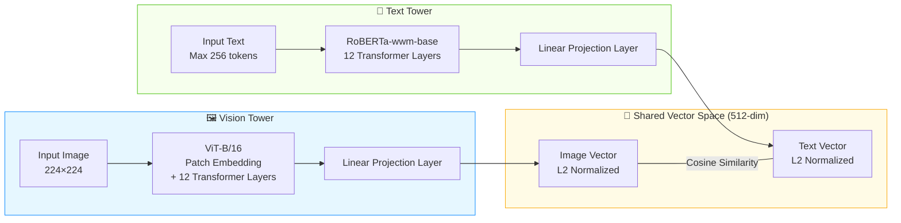

# Product Image Retrieval System Project Documentation

## 1. Project Architecture and Development Process

### 1.1 Overall Architecture

This project builds a Chinese product image retrieval system, adopting a layered architecture of "local CLIP model embedding + cloud vector database retrieval + Gradio frontend interaction". The system consists of 5 core components. The functions of each component are described below:

| Layer               | Component          | Function                                                     | Deployment |
| ------------------- | ------------------ | ------------------------------------------------------------ | ---------- |
| **Presentation**    | `ui.py` (Gradio)   | **TODO**                                                     | Local      |
| **Business**        | `search_engine.py` | Encapsulates the `ProductSearchEngine` class, loads the CLIP model during initialization, provides `encode_text()` and `encode_image()` methods to generate vectors, and `search_by_text()` and `search_by_image()` methods to call Upstash retrieval and return result lists `[{url, score}]`. | Local      |
| **Embedding**       | Chinese-CLIP model | ViT-B/16 image encoder + RoBERTa-wwm-base text encoder, maps images and text respectively to 512-dimensional normalized vectors, unified into the same semantic space. | Local GPU  |
| **Vector Database** | Upstash Vector     | Serverless vector database, stores precomputed product image embedding vectors, index type is DENSE, similarity function is COSINE, dimension is 512. | Cloud      |
| **Image Storage**   | Cloudflare R2      | Stores original product images, provides public URLs. Uses the `upload_to_r2_parallel.py` script to upload images via boto3 multithreading, and records public links in the form of `https://<bucket>.<account>.r2.dev/<filename>` in metadata. | Cloud      |

### 1.2 Development Process

The development of this project follows the process of "data preparation → offline model download → image upload to cloud → vector ingestion → search service deployment":

1. **Environment Preparation**: Use Python 3.13, install PyTorch, Transformers, Gradio, Upstash Vector, boto3, and other dependencies. Configure the `.env` environment variables (Upstash Vector credentials, R2 endpoint/key/bucket name/public domain).

2. **Offline CLIP Model Download**: Run `download_model.py` to download the `OFA-Sys/chinese-clip-vit-base-patch16` model to the local `./models/chinese-clip/` directory via `huggingface_hub.snapshot_download()`.

3. **Image Upload to Cloudflare R2**: Run `upload_to_r2_parallel.py`, using the boto3 client with multithreading (default 20 threads) to upload images from the `./images/` folder to a pre-created R2 bucket. Once completed, images can be publicly accessed via `R2_PUBLIC_URL/<filename>`, providing URL metadata for subsequent vector ingestion.

4. **Create Upstash Vector Index**: Create an index in the Upstash Console with the configuration: dimension=512, similarity function=COSINE, index type=DENSE, and embedding model set to "Bring Your Own Model (CUSTOM)".

5. **Image Embedding Ingestion (Data Pipeline)**: Run `image_embed_to_upstash_vector.py`, iterate over images in the `./images/` folder, use Chinese-CLIP to batch extract 512-dimensional feature vectors, perform L2 normalization on the vectors, and then upsert them in batches into Upstash Vector together with the R2 public URL metadata.

6. **Launch Search Service**: Run `python ui.py` **TODO**

### 1.3 File List

| File                               | Purpose                                                      |
| ---------------------------------- | ------------------------------------------------------------ |
| `download_model.py`                | Pre-download the CLIP model locally                          |
| `upload_to_r2_parallel.py`         | Multithreaded upload of images to Cloudflare R2 bucket       |
| `image_embed_to_upstash_vector.py` | Offline data pipeline: images → embedding vectors → Upstash ingestion |
| `search_engine.py`                 | Search engine class (ProductSearchEngine), encapsulating model loading, vector encoding, and retrieval interfaces |
| `ui.py`                            | **TODO**                                                     |
| `.env`                             | Environment variables (Upstash URL/Token, R2 endpoint/key/bucket name/public domain) |
| `models/chinese-clip/`             | Local offline model files (first downloaded by download_model.py) |

## 2. Dataset

### 2.1 Source

This system uses the **Products-10K** dataset, constructed by JD AI Research (JDAI) and released as the official dataset for the ICPR 2020 Large-Scale Product Recognition Challenge. All images in the dataset are collected from real online products on JD.com, covering both merchant product display images and user-submitted real-life photos. The dataset is described in the paper "Products-10K: A Large-scale Product Recognition Dataset" (arXiv:2008.10545), with the project homepage at [products-10k.github.io](https://products-10k.github.io/).

This dataset fills an important gap in the field of product recognition: before Products-10K, existing product benchmark datasets were either too small in scale (limited number of products) or contained noisy annotations (lacking manual annotation), making them insufficient to support high-precision SKU-level product recognition research.

### 2.2 Scale and Content

The key statistics of the Products-10K dataset are as follows:

- **Number of SKUs**: Approximately 10,000 fine-grained SKUs (stock keeping units), all of which are frequently purchased products by JD.com consumers.

- **Total Images**: About 150,000 images (with around 10,000 in the test set and 140,000 in the training set); due to differences in real application scenarios, the number of images per category is unevenly distributed.

- **Total Data Size**: Approximately 20 GB.

- **Category Coverage**: Covers 10 major categories of full-category products including fashion, 3C electronics, food, health care, and household items.

- **Annotation Hierarchy**: The annotation files contain two levels: `class` and `group`. The `class` level has over 9,000 categories, but some categories have very few samples (only 1-2 images); the `group` level has 360 categories, grouping classes with similar visual features together, making it more suitable for classification training.

- **Image Source and Characteristics**: The data comes from e-commerce product display images and user real-life photos, with less background clutter than ImageNet, and is closer to real-world internet e-commerce scenarios.

For this project, using approximately 55,000 training set images for embedding and ingestion can cover the main fine-grained product categories, meeting the cross-modal retrieval needs from Chinese text to images.

## 3. CLIP Model Technical Features

### 3.1 Model Selection and Architecture

This project adopts the **`OFA-Sys/chinese-clip-vit-base-patch16`** model, which is the base version of the Chinese-CLIP series released by Alibaba DAMO Academy, specifically designed for cross-modal image-text retrieval tasks in Chinese scenarios. The model employs the classic **dual-encoder architecture**:

- **Vision Tower**: Based on the **ViT-B/16** (Vision Transformer Base, Patch Size 16) architecture. The input image is split into 16×16 patches, encoded through 12 Transformer layers, and finally mapped to a 512-dimensional feature vector via a linear projection layer.
- **Text Tower**: Uses **RoBERTa-wwm-base** (a Chinese RoBERTa based on whole word masking), with 12 Transformer layers, supporting up to 256 tokens of Chinese input. Its pre-training approach based on Chinese whole word masking gives it stronger semantic understanding capabilities when processing Chinese phrases and product descriptions.
- **Feature Normalization**: The outputs of both towers undergo L2 normalization, projecting the vectors onto the unit hypersphere to ensure numerical stability in cosine similarity computation.

### 3.2 Training Mechanism and Key Technologies

1. **Large-Scale Chinese Pre-training**: The model was pre-trained using contrastive learning on approximately **200 million Chinese image-text pairs**, covering multiple domains such as news, encyclopedias, and e-commerce, enabling the model to generalize to different types of Chinese image-text matching scenarios.

2. **Contrastive Learning**: The model uses the InfoNCE loss function to pull matching image-text pairs closer and push non-matching pairs apart in the shared 512-dimensional semantic space. After training, the model can map images and text into the same semantic space, so that semantically similar images and texts have a small cosine distance, thus enabling cross-modal retrieval.

3. **Two-Stage Pre-training Strategy**: Chinese-CLIP proposes a unique two-stage training approach: in the first stage, the image encoder parameters are frozen and only the text encoder is trained, allowing text features to gradually align with the image feature space; in the second stage, all parameters are unfrozen for joint fine-tuning, further enhancing the cross-modal alignment capability of the model.

### 3.3 Application in This Project

| Search Mode      | Workflow                                                     |
| ---------------- | ------------------------------------------------------------ |
| **Text Search**  | User enters Chinese product description → CLIP text encoder → 512-dim query vector → L2 normalization → Upstash Vector cosine similarity retrieval → returns Top-K product image URLs and similarity scores in descending order of similarity. |
| **Image Search** | User uploads a product image → CLIP image encoder → 512-dim query vector → L2 normalization → Upstash Vector cosine similarity retrieval → returns image URLs and similarity scores of visually similar products. |

## 4. Mapping the Five-Stage Search Framework to the Interface

### 4.1 Framework Stages and Corresponding UI Design

1. **Query Formulation**

2. **Query Understanding**

3. **Search Execution**

4. **Result Presentation**

5. **Interaction & Refinement**

### 4.2 How Users Perceive the Five Stages

## 5. User Experience Design for Two Input Modes

### 5.1 Operational Differences Between Text Input and Image Input

- **Text Input (Text Search)**

- **Image Input (Image Search)**

### 5.2 Unified Friendly Design Strategies

### 5.3 Future Optimization Directions